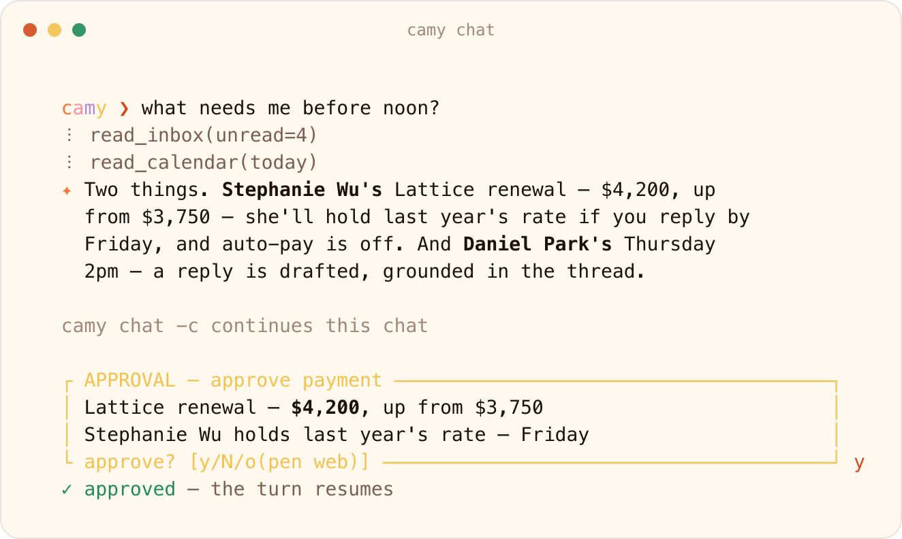
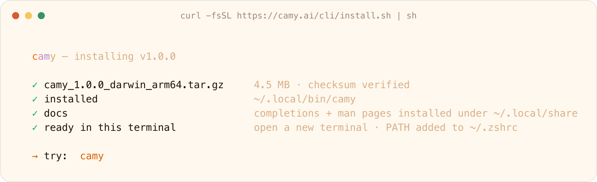
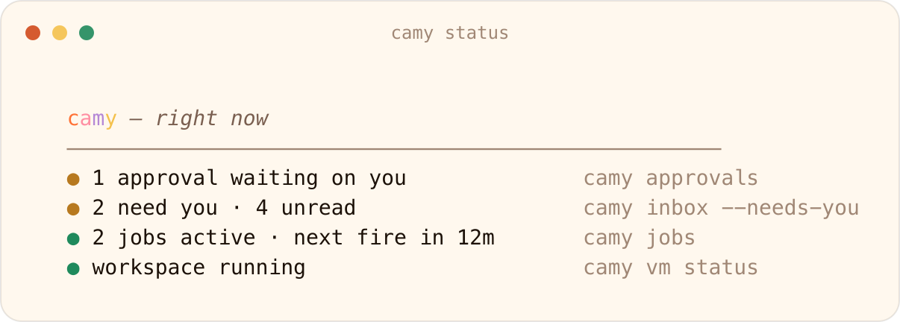
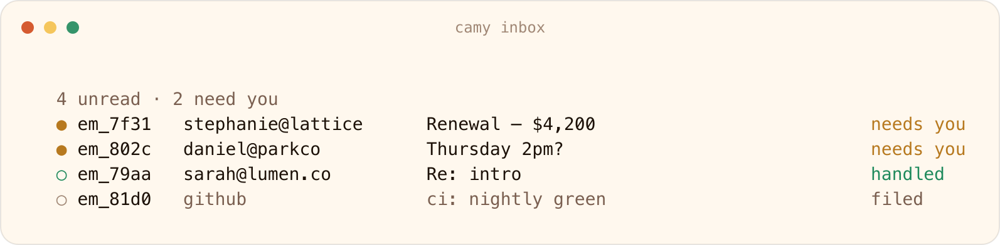
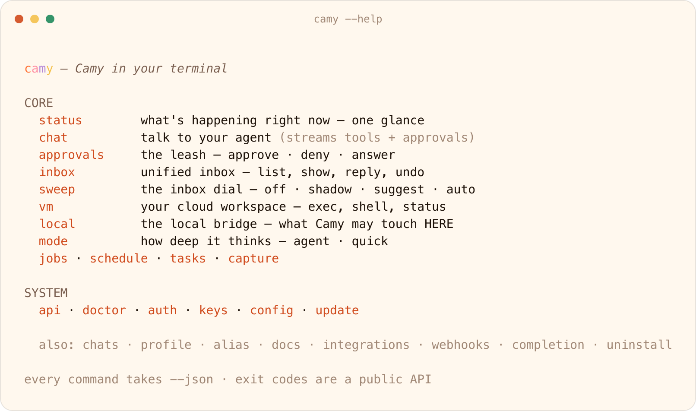

<p align="center">
  <picture>
    <source media="(prefers-color-scheme: dark)" srcset="docs/assets/camy-logo-white.png">
    
  </picture>
</p>

<p align="center">
  <b>Camy in your terminal.</b><br>
  Triage the inbox, draft the replies, chase the invoice, hold the calendar,<br>
  review the diff, run the tests, publish the site, schedule the rest.<br>
  One binary, in every shell, pipe, and cron job you already have.
</p>

<p align="center">
  <a href="https://github.com/trycamy/cli/releases/latest"></a>
  <a href="https://github.com/trycamy/cli/releases/latest"></a>
  <a href="https://github.com/trycamy/cli/actions/workflows/ci.yml"></a>
  <a href="docs/installation.md#homebrew"></a>
  <a href="docs/installation.md"></a>
  <a href="docs/README.md"></a>
  <a href="SECURITY.md"></a>
</p>

<p align="center">
  <a href="#install">Install</a>&nbsp;&nbsp;·&nbsp;&nbsp;
  <a href="docs/quickstart.md">Quick start</a>&nbsp;&nbsp;·&nbsp;&nbsp;
  <a href="docs/README.md">Docs</a>&nbsp;&nbsp;·&nbsp;&nbsp;
  <a href="docs/reference/camy.md">Reference</a>&nbsp;&nbsp;·&nbsp;&nbsp;
  <a href="docs/scripting.md">Scripting</a>&nbsp;&nbsp;·&nbsp;&nbsp;
  <a href="SECURITY.md">Security</a>
</p>

<br>

<p align="center">
  <picture>
    <source media="(prefers-color-scheme: dark)" srcset="docs/assets/camy-chat-dark.png">
    
  </picture>
  <br>
  <sub>Ask. It reads, it answers, and it stops at the amber box until you say <code>y</code>. Real output, sample data.</sub>
</p>

<br>

## Install

```bash
# macOS and Linux, arm64 and amd64. No sudo.
curl -fsSL https://camy.ai/cli/install.sh | sh

# or, with Homebrew
brew tap trycamy/tap && brew install camy

# or, with npm
npm install -g @camy/cli
```

Nothing unpacks until its checksum matches. [Installation](docs/installation.md)
covers manual downloads, pinning a version,
[`camy update`](docs/reference/camy_update.md), and uninstalling.

<p align="center">
  <picture>
    <source media="(prefers-color-scheme: dark)" srcset="docs/assets/camy-install-dark.png">
    
  </picture>
  <br>
  <sub>The installer, as it runs.</sub>
</p>

## Sixty seconds

```bash
camy auth login                          # browser handoff; a scoped, expiring key lands in your keychain
camy status                              # what is happening right now
camy chat "what needs me before noon?"   # one turn, streamed, with every tool call
git diff | camy chat "review this"       # stdin is context, stdout is the reply
camy approvals                           # what is waiting on you
camy inbox --needs-you                   # the rows that need a decision
camy vm exec -- pytest -q                # your cloud workspace; the exit code is mirrored
```

No `--api-key` flag exists. Sign in once; the key lives in your keychain, and
scripts read `CAMY_API_KEY`. Bare `camy` opens the full-screen app.
[Quick start](docs/quickstart.md) walks the whole minute.

<p align="center">
  <picture>
    <source media="(prefers-color-scheme: dark)" srcset="docs/assets/camy-status-dark.png">
    
  </picture>
  <br>
  <sub><code>camy status</code>: what needs you, and the command that opens it.</sub>
</p>

## What it does

<table>
<tr>
<td width="33%" valign="top">
<b><a href="docs/chat.md">Chat</a></b><br>
Ask; watch every tool call stream. Anything risky stops for you. <code>-c</code> continues, stdin is context.
</td>
<td width="33%" valign="top">
<b><a href="docs/approvals.md">Approvals</a></b><br>
The pauses. Approve, deny, or answer from anywhere; <code>--wait</code> streams the resumed turn.
</td>
<td width="33%" valign="top">
<b><a href="docs/inbox.md">Inbox</a></b><br>
A verdict on every message: needs you, handled, filed. Reply, undo, restore. A sweep dial from off to auto.
</td>
</tr>
<tr>
<td width="33%" valign="top">
<b><a href="docs/workspace.md">Workspace</a></b><br>
Your cloud computer. <code>vm exec</code> hands you the exit code, ssh-style; <code>vm shell</code> is a live PTY.
</td>
<td width="33%" valign="top">
<b><a href="docs/local-bridge.md">Local bridge</a></b><br>
The same agent in the project you are standing in. One card per action; secrets and destructive commands refused.
</td>
<td width="33%" valign="top">
<b><a href="docs/automation.md">Automation</a></b><br>
Schedules, durable jobs, tasks, capture, webhooks. The same binary, in cron or CI.
</td>
</tr>
<tr>
<td width="33%" valign="top">
<b><a href="docs/canvas.md">Canvas</a></b><br>
What a chat built, on disk: files, snapshots, published sites.
</td>
<td width="33%" valign="top">
<b><a href="docs/scripting.md">Scripts</a></b><br>
<code>--json</code> everywhere, <code>--jq</code> and <code>--template</code> built in, NDJSON streams, frozen exit codes.
</td>
<td width="33%" valign="top">
<b><a href="docs/terminal.md">Terminal</a></b><br>
Truecolor to plain. <code>NO_COLOR</code>, <code>--accessible</code>, hyperlinks and inline images where supported.
</td>
</tr>
</table>

<p align="center">
  <picture>
    <source media="(prefers-color-scheme: dark)" srcset="docs/assets/camy-inbox-dark.png">
    
  </picture>
  <br>
  <sub><code>camy inbox</code>: a verdict on every row.</sub>
</p>

## The leash

Anything risky pauses for a human. The pause is the safety model, not a setting.

- **It fails closed.** Headless, with `--no-input`, `--json`, or no terminal, the approval stays pending and the exit is `4` with its id. Timeouts never approve and never deny.
- **It reads `/dev/tty`, never stdin.** Piped input cannot answer a prompt. There is no yes-to-everything flag.
- **The local bridge asks per action.** Reads run; every write and every command shows the exact command or diff first. `.env`, `~/.ssh`, keys, credential stores, `sudo`, and `rm -rf` on root-like targets are refused, whatever anyone approved.

[Approvals](docs/approvals.md) · [The local bridge](docs/local-bridge.md) · [SECURITY.md](SECURITY.md)

## Scripts

stdout is data. stderr is everything else. `--json` on any command, `--jq`
and `--template` built in, streams as NDJSON. Exit codes, frozen for 1.x:

| `0` | `1` | `2` | `3` | `4` | `5` | `6` | `7` | `8` | `255` |
| :-: | :-: | :-: | :-: | :-: | :-: | :-: | :-: | :-: | :-: |
| ok | runtime | usage | auth | approval pending | rate limited | plan | unavailable | approval denied | `vm exec` itself failed |

```bash
camy inbox --needs-you --json --jq '.[].subject'
camy api GET /v1/jobs --jq '.[].id'
camy chat --no-input "post the nightly summary"   # exit 4: waiting on you, not a failure
```

[Scripting](docs/scripting.md) · [Exit codes](docs/exit-codes.md)

## Documentation

<p align="center">
  <picture>
    <source media="(prefers-color-scheme: dark)" srcset="docs/assets/camy-help-dark.png">
    
  </picture>
</p>

Every guide is in [docs](docs/README.md); every command and flag is in the
[reference](docs/reference/camy.md), generated from the binary. `camy docs`
carries the topics offline, and every command answers `--help`.

<br>

<p align="center">
  <a href="SUPPORT.md">Support</a>&nbsp;&nbsp;·&nbsp;&nbsp;
  <a href="SECURITY.md">Security</a>&nbsp;&nbsp;·&nbsp;&nbsp;
  <a href="CHANGELOG.md">Changelog</a>&nbsp;&nbsp;·&nbsp;&nbsp;
  <a href="CODE_OF_CONDUCT.md">Conduct</a>&nbsp;&nbsp;·&nbsp;&nbsp;
  <a href="THIRD-PARTY-NOTICES.md">Third-party notices</a>&nbsp;&nbsp;·&nbsp;&nbsp;
  <a href="LICENSE.md">License</a>
</p>

<p align="center">
  <sub>© 2026 CamyAI, Inc. All rights reserved.</sub>
</p>
